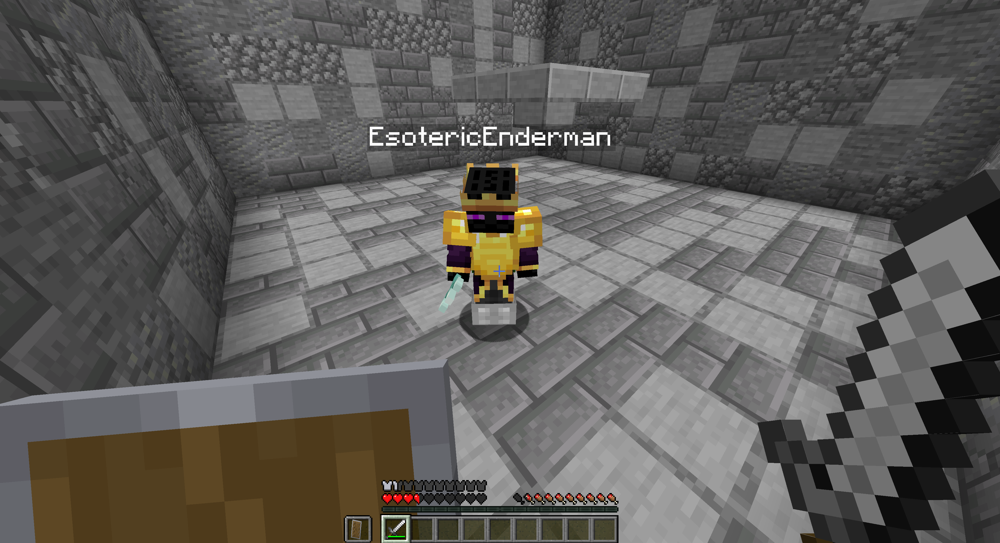
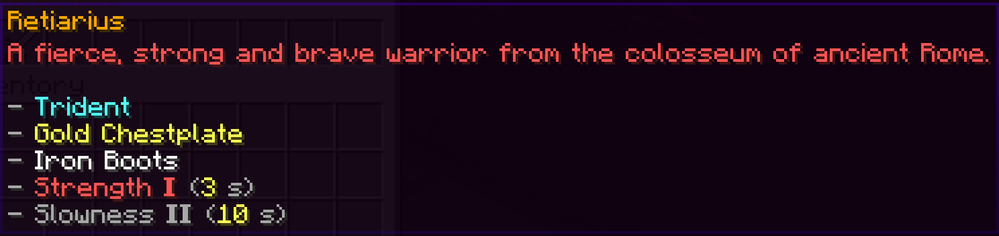
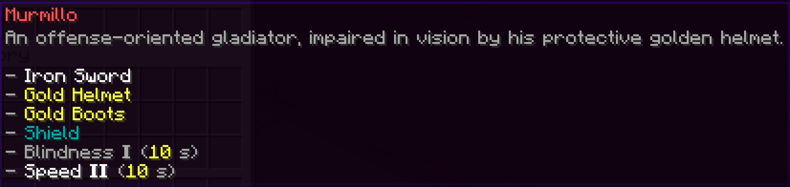
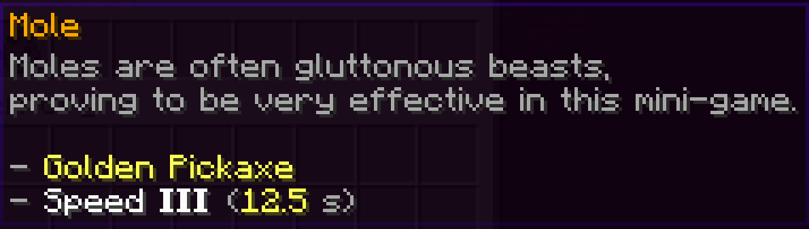
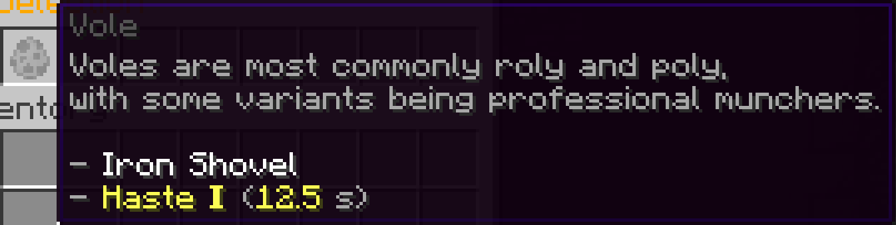
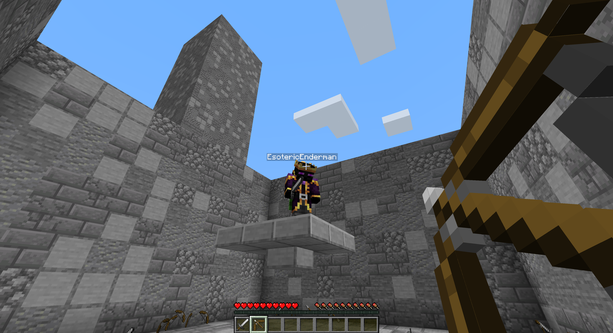
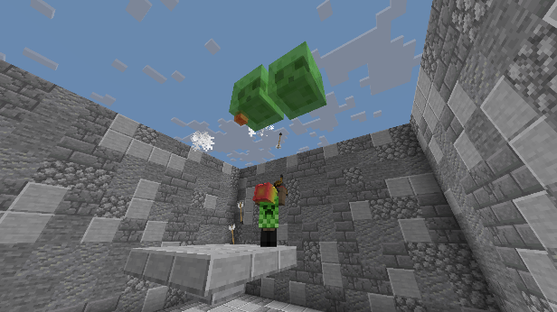
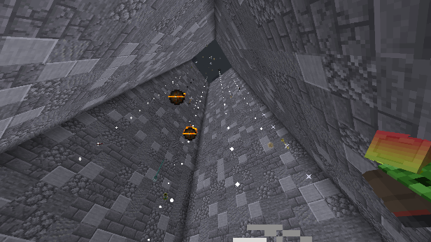

# Block Warriors

A collection of fun Minecraft minigames in the form of a plugin.

## Requirements

- [Block Warriors World](https://github.com/esotericenderman/block-warriors-world)

## Gallery

### Games

#### Gladiators

##### Kits

#### Block Munchers

##### Kits

#### One in the Chamber

#### Slime Shooter

#### Avoid the Rain

#### King of the Hill

#### Cactus Castle

## License

&copy; 2024-2025 [Esoteric Enderman](https://enderman.dev)\
&copy; 2025 [Block Warriors contributors](https://github.com/esotericenderman/block-warriors/graphs/contributors)

[Block Warriors](/) is licensed under the [AGPL 3.0](./LICENSE) only.

The submodule in this project has its own respective license.

## Disclaimer

NOT AN OFFICIAL MINECRAFT PRODUCT. NOT APPROVED BY OR ASSOCIATED WITH MOJANG OR MICROSOFT.

## Topics

[java](https://github.com/topics/java), [minecraft](https://github.com/topics/minecraft), [paper](https://github.com/topics/paper), [minigames](https://github.com/topics/minigames), [minigame](https://github.com/topics/minigame), [minecraft-plugin](https://github.com/topics/minecraft-plugin), [mc](https://github.com/topics/mc), [minecraft-minigames](https://github.com/topics/minecraft-minigames), [paper-plugin](https://github.com/topics/paper-plugin), [minigame-plugin](https://github.com/topics/minigame-plugin), [minecraft-minigame](https://github.com/topics/minecraft-minigame), [papermc](https://github.com/topics/papermc), [papermc-plugin](https://github.com/topics/papermc-plugin), [mc-plugin](https://github.com/topics/mc-plugin), [minecraft-paper](https://github.com/topics/minecraft-paper), [paper-plugins](https://github.com/topics/paper-plugins), [mc-plugins](https://github.com/topics/mc-plugins), [minecraft-paper-plugin](https://github.com/topics/minecraft-paper-plugin), [java-21](https://github.com/topics/java-21), [paper-plugin-development](https://github.com/topics/paper-plugin-development)
